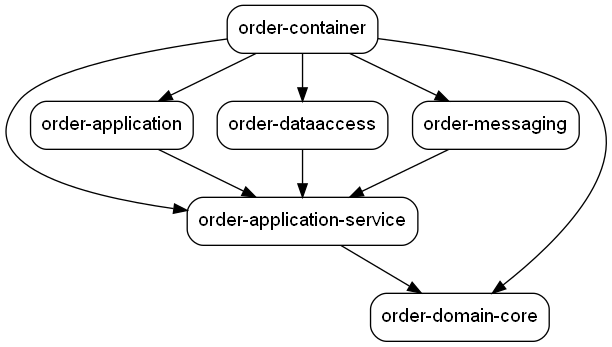

# food-ordering-system
Microservice - Clean Architecture 

### Builder Plugin used for core doamin

https://plugins.jetbrains.com/plugin/7354-innerbuilder

### generate graph command
https://graphviz.org/

mvn com.github.ferstl:depgraph-maven-plugin:aggregate -DcreateImage=true -DreduceEdges=false -Dscope=compile "-Dincludes=com.food.ordering.system*:*"
